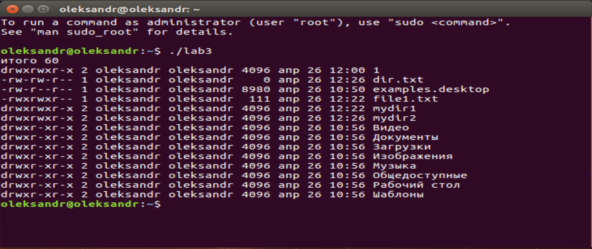
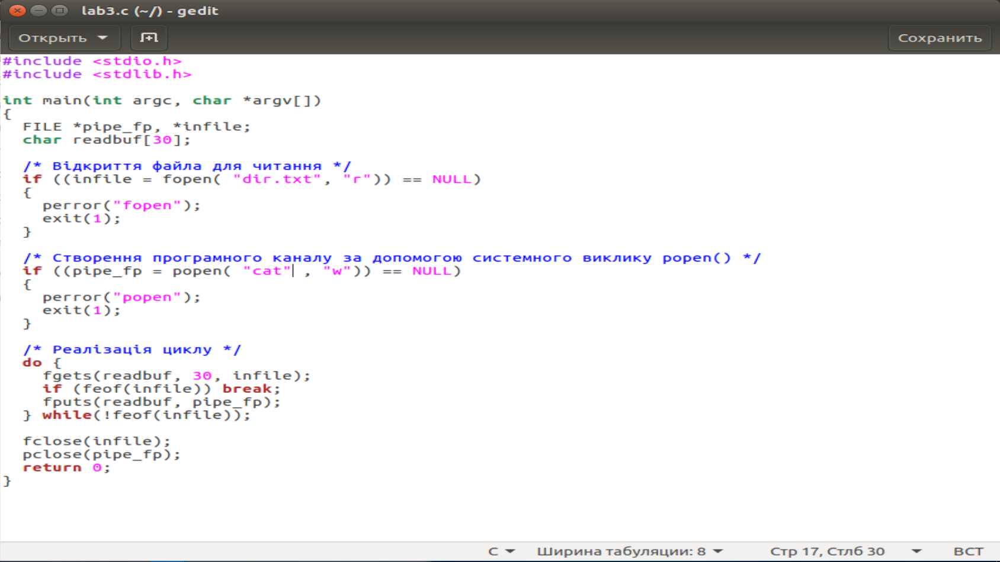

Знайомство з основними механізмами реалізації технології "клієнт-сервер" в ОС Unix, робота з неіменованими каналами

Мета
Ознайомити з основними механізмами реалізації новітніх технологій ("клієнт-сервер"), розбір програми роботи з неіменованими каналами.

Завдання
Розробити програму що зчитує файл та передає його вміст іншій команді, за допомогою неіменованого каналу.

